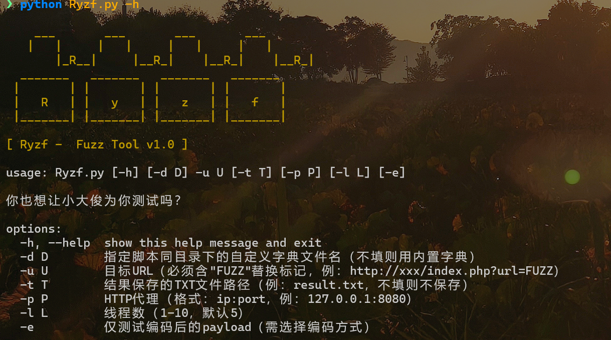
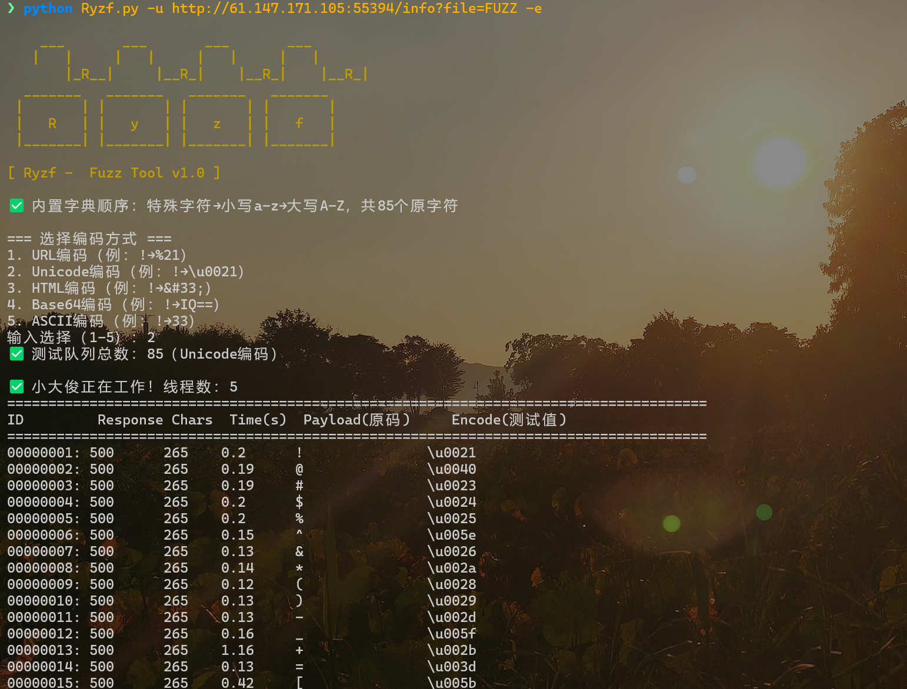

# Ryzf 

一款轻量级的CTF/渗透测试Fuzz工具，专为URL/输入框的字符模糊测试设计，支持多编码方式、多线程、代理转发等功能，适配CTF竞赛和渗透测试中的字符注入检测场景。

## 🔥 功能特性
- **多编码支持**：原生字符/URL/Unicode/HTML/Base64/ASCII编码的Payload生成，覆盖常见编码绕过场景；
- **固定测试顺序**：按「特殊字符→小写字母→大写字母」顺序测试，便于结果分析；
- **终端可视化**：像素化启动界面 + 实时格式化回显测试结果（含响应码/长度/时间）；
- **工程化设计**：支持多线程（1-10）、代理转发（BurpSuite等）、测试结果本地保存；
- **灵活字典**：内置全覆盖默认字典，也支持自定义字典文件（同目录加载）。

```
Python 版本	Python 3.6 及以上
pip install -r requirements.txt
```



````
usage: Ryzf.py [-h] [-d D] -u U [-t T] [-p P] [-l L] [-e]

options:
  -h, --help  show this help message and exit
  -d D        指定脚本同目录下的自定义字典文件名（不填则用内置字典）
  -u U        目标URL（必须含"FUZZ"替换标记，例：http://xxx/index.php?url=FUZZ）
  -t T        结果保存的TXT文件路径（例：result.txt，不填则不保存）
  -p P        HTTP代理（格式：ip:port，例：127.0.0.1:8080）
  -l L        线程数（1-10，默认5）
  -e          仅测试编码后的payload（需选择编码方式）

````


